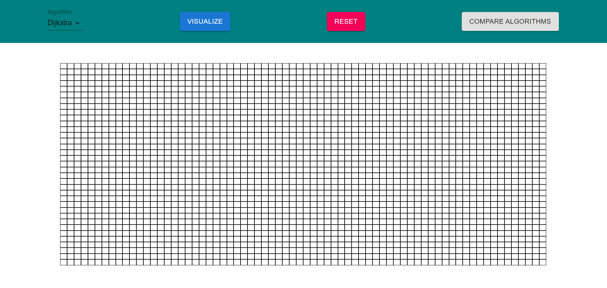
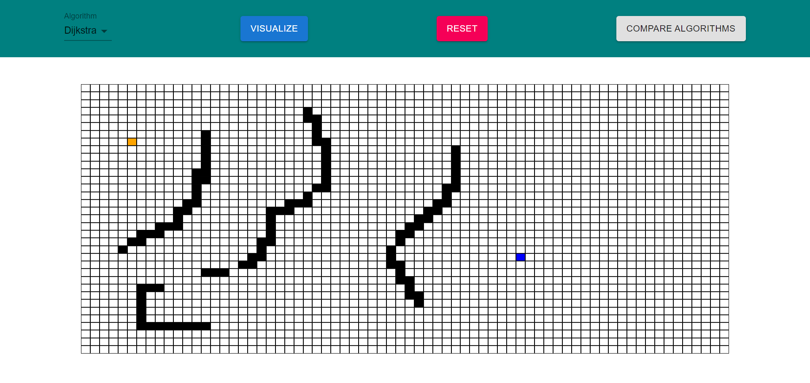
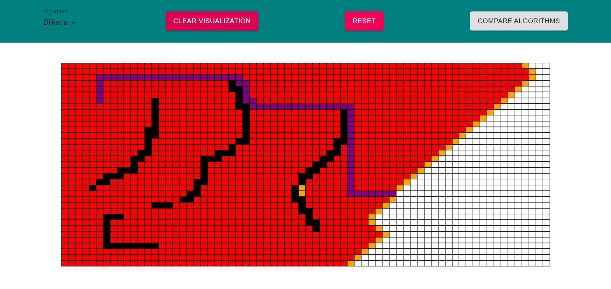
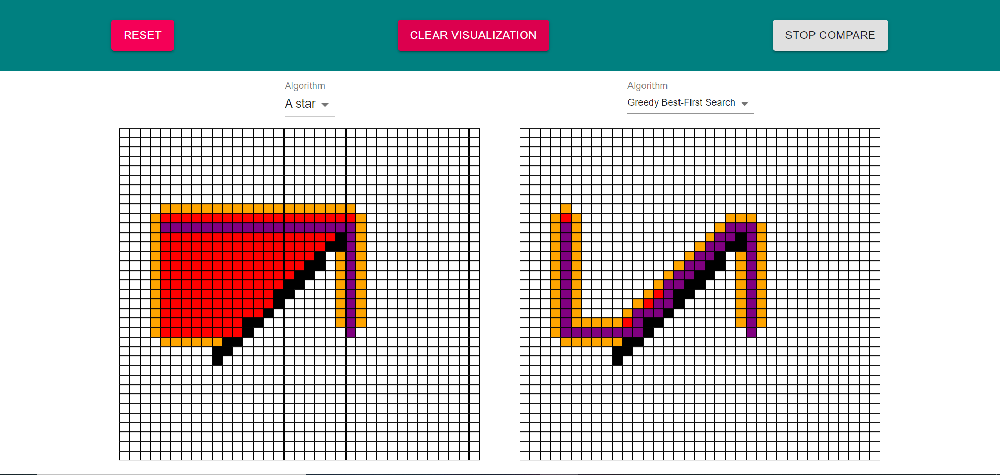

# Pathfinding algorithm visualization tool

This application is a visualization tool which allows a user to see how different pathfinding algorithms search for the shortest path. For now, users can see the visualization of the Dijkstra, the Greedy Best-First search and the A Star algorithms. 

I did this project mainly to learn about pathfinding algorithms and to get better at doing visualization tools. I also wanted to get better in Typescript. 
 

## How does it work 

It's quite simple, click on the grid to set the start (orange) and then end (blue). Then, put some walls by dragging your mouse while the left button is pressed. You can also change the algorithm for the visualization.  

After, press on visualize to see the algorithm in action.

To reset the visualization without clearing the walls or the start and end positions, press clear visualization. To clear everything, press reset. You can also compare two algorithms at the same time by clicking on ‘Compare Algorithms’. To compare two algorithms, interact with the left grid to setup the start position, the end position and put the walls. They are going to copy on the right grid so both sides are the same. Then, press visualize to see both algorithms in action. 

## Installation

You need all the things for a basic react app, react-router-dom and material-ui.

Run 'npm start' to start the server and try out this visualization tool